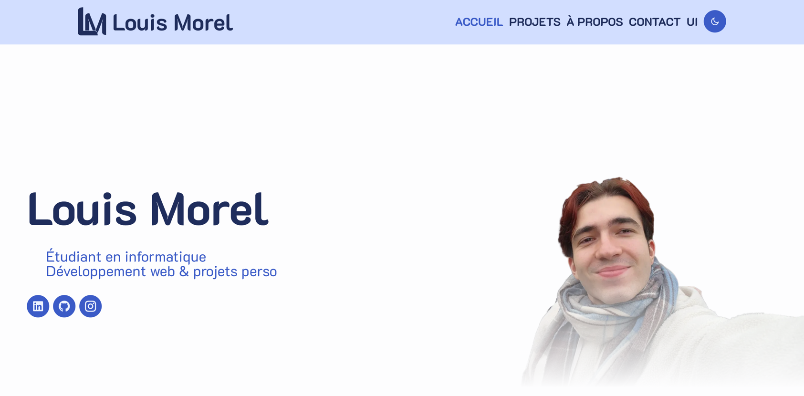
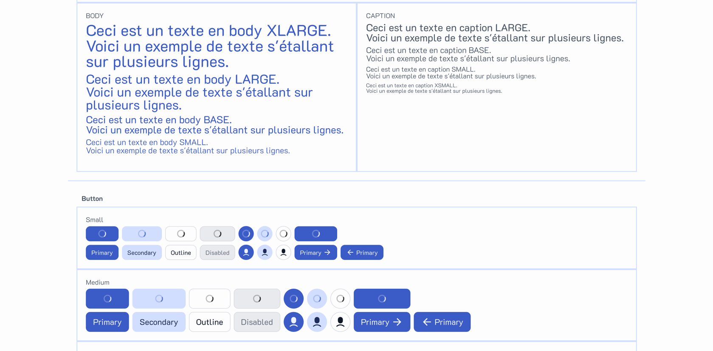

<!-- Improved compatibility of back to top link: See: https://github.com/othneildrew/Best-README-Template/pull/73 -->
<a id="readme-top"></a>

<!-- PROJECT SHIELDS -->
<!--
*** I'm using markdown "reference style" links for readability.
*** Reference links are enclosed in brackets [ ] instead of parentheses ( ).
*** See the bottom of this document for the declaration of the reference variables
*** for contributors-url, forks-url, etc. This is an optional, concise syntax you may use.
*** https://www.markdownguide.org/basic-syntax/#reference-style-links
-->
[![Issues][issues-shield]][issues-url]
[![Unlicense License][license-shield]][license-url]
[![LinkedIn][linkedin-shield]][linkedin-url]


<!-- PROJECT LOGO -->
<br />
<div align="center">
  <a href="https://github.com/lm38550/portfolio">
    
  </a>

<h3 align="center">Portfolio - Louis Morel</h3>

  <p align="center">
    <a href="https://louismorel.dev">Visit the website</a>
    &middot;
    <a href="https://github.com/lm38550/portfolio/issues/new?labels=bug&template=bug-report---.md">Report bug</a>
  </p>
</div>

<div>
  <p>
    <a href="https://github.com/lm38550/portfolio/blob/main/README_FR.md">🇫🇷 - Version française</a>
  </p>
  <p>
    <a href="https://github.com/lm38550/portfolio/blob/main/README.md">🇬🇧 - English version</a>
  </p>
</div>
<br/>

<!-- TABLE OF CONTENTS -->
<details>
  <summary>Table of Contents</summary>
  <ol>
    <li>
      <a href="#about-the-project">About The Project</a>
      <ul>
        <li><a href="#built-with">Built With</a></li>
      </ul>
      <ul>
        <li><a href="#application-screenshots">Application screenshots</a></li>
      </ul>
    </li>
    <li>
      <a href="#getting-started">Getting Started</a>
      <ul>
        <li><a href="#prerequisites">Prerequisites</a></li>
        <li><a href="#installation">Installation</a></li>
      </ul>
    </li>
    <li><a href="#license">License</a></li>
    <li><a href="#contact">Contact</a></li>
    <li><a href="#acknowledgments">Acknowledgments</a></li>
  </ol>
</details>


<!-- ABOUT THE PROJECT -->

## About The Project

In order to present my projects, my career and my objectives, I made my own website to permit you to know better about
me.

On the website you will find :

* All my projects
* My resume
* A contact section

<p align="right">(<a href="#readme-top">back to top</a>)</p>

### Built With

* [![Next][Next.js]][Next-url]
* [![React][React.js]][React-url]
* [![TailWindCSS][TailWindCSS.js]][TailWindCSS-url]

<p align="right">(<a href="#readme-top">back to top</a>)</p>

### Application screenshots

<p align="center">
  <a href="https://louismorel.dev">
    
  </a>
  <a href="https://louismorel.dev/ui">
    
  </a>
</p>
<!-- GETTING STARTED -->

## Getting Started

### Prerequisites

First of all you must have Node.js on your computer. If not you can install it
following the next instructions.

* Linux & Linus sub-systems
  ```sh
  apt install nodejs
  apt install npm
  ```
* Mac-OS
  ```sh
  brew install node
  ```
* Windows

Go directly on [Node.js Website](https://nodejs.org/en/download), in the install section

### Installation

1. Clone the repo
   ```sh
   git clone https://github.com/lm38550/portfolio.git
   ```
2. Install NPM packages
   ```sh
   npm install
   ```
3. Start the project
   ```sh
   npm run dev
   ```

<p align="right">(<a href="#readme-top">back to top</a>)</p>

[//]: # (<!-- USAGE EXAMPLES -->)

[//]: # ()
[//]: # (## Usage)

[//]: # ()
[//]: # (Use this space to show useful examples of how a project can be used. Additional screenshots, code examples and demos)

[//]: # (work well in this space. You may also link to more resources.)

[//]: # ()
[//]: # (_For more examples, please refer to the [Documentation]&#40;https://example.com&#41;_)

[//]: # ()
[//]: # (<p align="right">&#40;<a href="#readme-top">back to top</a>&#41;</p>)

<!-- ROADMAP -->

[//]: # (## Roadmap)

[//]: # ()
[//]: # (- [x] Add Changelog)

[//]: # (- [x] Add back to top links)

[//]: # (- [ ] Add Additional Templates w/ Examples)

[//]: # (- [ ] Add "components" document to easily copy & paste sections of the readme)

[//]: # (- [ ] Multi-language Support)

[//]: # (    - [ ] Chinese)

[//]: # (    - [ ] Spanish)

[//]: # ()
[//]: # (See the [open issues]&#40;https://github.com/othneildrew/Best-README-Template/issues&#41; for a full list of proposed features)

[//]: # (&#40;and known issues&#41;.)

[//]: # ()
[//]: # (<p align="right">&#40;<a href="#readme-top">back to top</a>&#41;</p>)

<!-- LICENSE -->

## License

Distributed under the MIT License. See `LICENSE.txt` for more information.

<p align="right">(<a href="#readme-top">back to top</a>)</p>


<!-- CONTACT -->

## Contact

Morel Louis - lm38550@gmail.com

Project Link: https://github.com/lm38550/portfolio

<p align="right">(<a href="#readme-top">back to top</a>)</p>


<!-- ACKNOWLEDGMENTS -->

## Acknowledgments

This website was made thanks to the following formation

* [Remote Monkey - Création d'une Application Web avec React, Next.js, Firebase, Tailwind CSS](https://www.youtube.com/playlist?list=PLtKaauZVThjAe3U3AQqa-C1fLwHR48aMM)

<p align="right">(<a href="#readme-top">back to top</a>)</p>

<!-- MARKDOWN LINKS & IMAGES -->
<!-- https://www.markdownguide.org/basic-syntax/#reference-style-links -->

[issues-shield]: https://img.shields.io/github/issues/lm38550/portfolio.svg?style=for-the-badge
[issues-url]: https://github.com/lm38550/portfolio/issues
[license-shield]: https://img.shields.io/github/license/lm38550/portfolio.svg?style=for-the-badge
[license-url]: https://github.com/lm38550/portfolio/blob/main/LICENSE.txt
[linkedin-shield]: https://img.shields.io/badge/-LinkedIn-black.svg?style=for-the-badge&logo=linkedin&colorB=555
[linkedin-url]: https://linkedin.com/in/louis-morel-info69/
[main-page-screenshot]: public/screenshots/main-page.png
[ui-page-screenshot]: public/screenshots/ui-page.png
[Next.js]: https://img.shields.io/badge/next.js-000000?style=for-the-badge&logo=nextdotjs&logoColor=white
[Next-url]: https://nextjs.org/
[React.js]: https://img.shields.io/badge/React-20232A?style=for-the-badge&logo=react&logoColor=61DAFB
[React-url]: https://reactjs.org/
[TailWindCSS.js]: https://img.shields.io/badge/Tailwind_CSS-grey?style=for-the-badge&logo=tailwind-css&logoColor=38B2AC
[TailWindCSS-url]: https://tailwindcss.com

